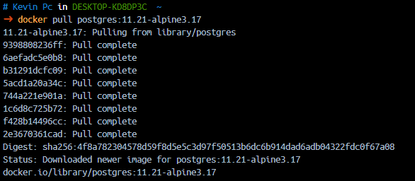
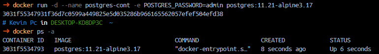
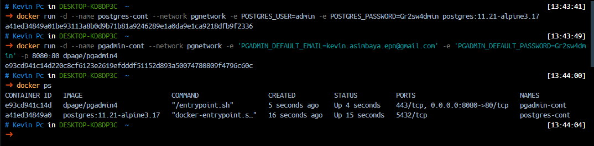
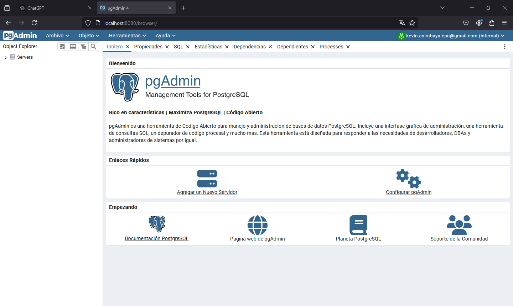
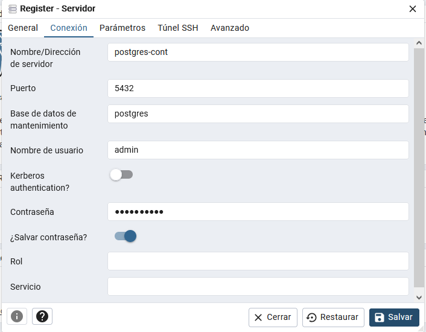
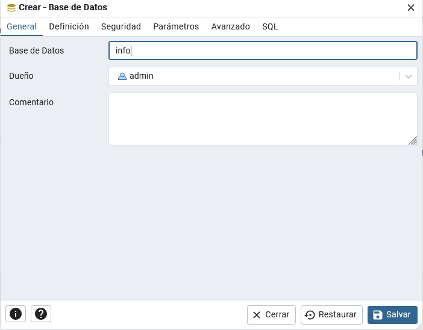
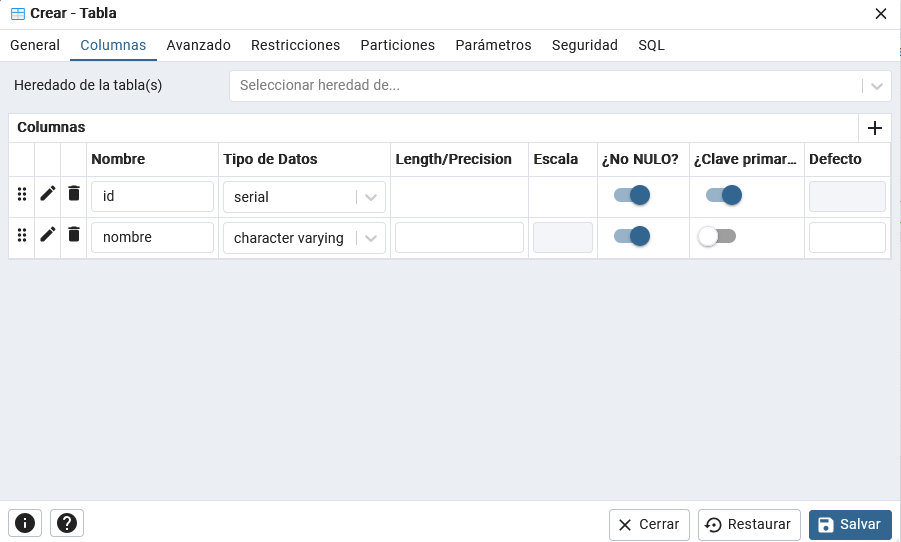
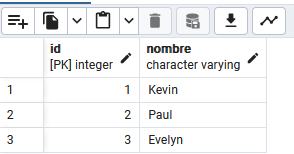
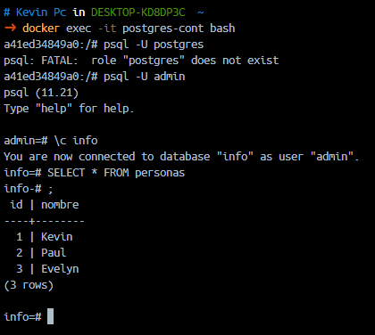

### Crear contenedor de Postgres sin que exponga los puertos. Usar la imagen: postgres:11.21-alpine3.17



### Crear un cliente de postgres. Usar la imagen: dpage/pgadmin4

```
docker run -d --name pgadmin-cont --network pgnetwork -e PGADMIN_DEFAULT_EMAIL=kevin.asimbaya.epn@gmail.com -e PGADMIN_DEFAULT_PASSWORD=Gr2sw4dmin -p 8080:80 dpage/pgadmin4
```


La figura presenta el esquema creado en donde los puertos son:
- a: 8080
- b: 80
- c: 5432


## Desde el cliente
### Acceder desde el cliente al servidor postgres creado.
# COMPLETAR CON UNA CAPTURA DEL LOGIN


### Crear la base de datos info, y dentro de esa base la tabla personas, con id (serial) y nombre (varchar), agregar un par de registros en la tabla, obligatorio incluir su nombre.




## Desde el servidor postgresl
### Acceder al servidor
### Conectarse a la base de datos info
### Realizar un select *from personas
# AGREGAR UNA CAPTURA DE PANTALLA DEL RESULTADO
